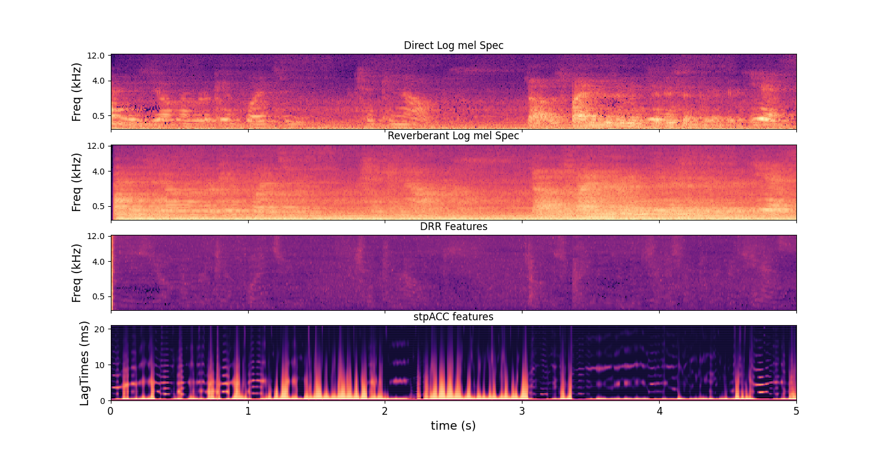

# Distance Input Features for 3D SELD

This is a Python implementation of the feature extraction methods described in the paper "Reverberation-based Features for Sound Event Localization and Detection with Distance Estimation" (preprint).
> D. Berghi, P. J. B. Jackson. Reverberation-based Features for Sound Event Localization and Detection with Distance Estimation. arXiv preprint arXiv: 2504.08644, 2025. [[**arXiv**]](https://arxiv.org/abs/2504.08644)

The paper introduces two novel approaches to extract distance features for 3D SELD based on reverberation. The first consists of extracting direct and reverberant signal components. These can either be used independently (**D+R features**) or in the form of direct-to-reverberant ratio in log mel space (**DRR features**). The second computes the short-term power of the signal autocorrelation to provide the model with insights into early reflections (**stpACC features**).

### Dependencies

This implementation leverages the `nara_wpe` dereverberation library for extracting direct and reverberant signal components, as well as other commonly used libraries for audio processing. Make sure you have installed:
```
nara_wpe
numpy
scipy
librosa
matplotlib (optional)
```
We used the `nara_wpe` library by Drude et al. (https://github.com/fgnt/nara_wpe) to extract the direct sound component. You are free to use different methods, but make sure to acknowledge their work if you use `nara_wpe`.
Their library can be easily installed with:
```
pip install nara_wpe
```
### Usage

`extractFeatures.py` will automatically extract and plot the features from `clip.wav`. The provided clip is a FOA snipped extracted from the STARSS23 dataset. You can load your desired audio file by changing `audio_path`.

Set your preferred log mel spectrogram hyperparameters. These will be used for D+R and DRR features.
```
n_fft = 512
hop_length = 150
n_mels = 64
```

Set metaparameters for short-term power of the autocorrelation (stpACC) features.

We recommend considering time lags up to about 20ms, but you are free to explore different values. 
So, considering only positive time lags in the autocorrelation function, choose `stp_n_fft` so that (stp_n_fft / 2) / fs ≈ 20ms

E.g. for fs=24kHz we used stp_n_fft=1024 

Downsampling the autocorrelation is optional, but useful to allow concatenation with other SELD features, e.g., log-mel spectrograms, IVs, SALSA, etc.
For example, if you have log mel spectrograms with 64 mel bins, and have stp_n_fft/2 = 512 positive time lags, you should set ds_factor=8
```
stp_n_fft = 1024
stp_hop_length = 150
downsample = True
ds_factor = 8 # downsampling factor
```

### Visualization of the Distance Features



# Citation

Please consider citing our paper if you use these features in your work. Many thanks!

> Davide Berghi and Philip J. B. Jackson. Reverberation-based Features for Sound Event Localization and Detection with Distance Estimation. arXiv preprint arXiv: 2504.08644, 2025.

## References

* L. Drude et al. “NARAWPE: A Python package for weighted prediction error dereverberation in Numpy and Tensorflow for online and offline processing,” in Speech Communication, 2018.
* K. Shimada et al. “STARSS23: An audio-visual dataset of spatial recordings of real scenes with spatiotemporal annotations of sound events,” in NeurIPS, 2023.
* D. Diaz-Guerra et al. “Baseline models and evaluation of sound event localization and detection with distance estimation in DCASE 2024 Challenge,” in DCASE Workshop, 2024.
  
